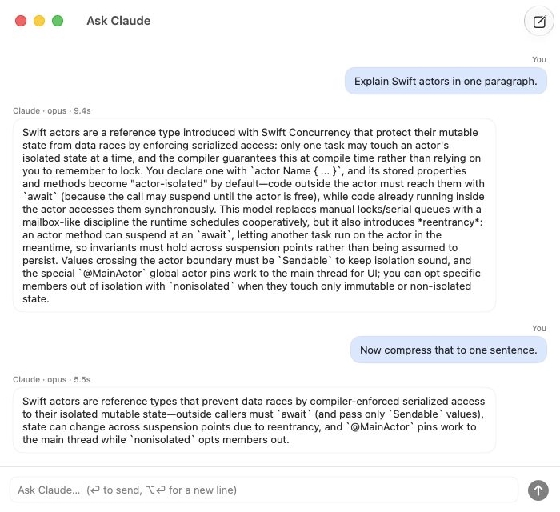

# Ask Claude

A tiny native macOS chat app for your **Claude subscription** — no API key, no extra billing.

It shells out to the [Claude Code CLI](https://claude.com/claude-code) (`claude -p`) that you already have installed, so every question runs on your existing Claude Pro/Max plan, exactly like asking in a terminal — but with a real chat window, live streaming, and multi-turn memory.



## Why

- **Zero API key.** Uses the `claude` binary's own login. If `claude` works in your terminal, this app works.
- **Streaming progress.** Connecting → model confirmed → tokens render as they arrive. No staring at a blank window.
- **Multi-turn memory.** Conversations resume via the CLI's session mechanism (`--resume`). ⌘N starts a fresh one.
- **Native and tiny.** Pure SwiftUI, one small binary, no Electron, no web view, no background daemon.
- **Opus by default.** Quick questions deserve the best model; switch with one `defaults write` (below).

## Requirements

- macOS 15+ (Apple Silicon)
- [Claude Code CLI](https://claude.com/claude-code) installed and logged in (`claude` works in your terminal)
- A Claude subscription (Pro / Max)

## Install

**From a release:** download `AskClaude-<version>-arm64.zip` from [Releases](../../releases), unzip, move `Ask Claude.app` to `/Applications`.

The app is ad-hoc signed (no paid Apple Developer certificate), so macOS will quarantine the download. Clear it once:

```bash
xattr -cr "/Applications/Ask Claude.app"
```

or right-click the app → Open, then allow it under **System Settings → Privacy & Security**.

**From source:**

```bash
git clone https://github.com/zengtianli/ask-claude.git
cd ask-claude
./build.sh --install   # requires Xcode
```

## Configuration

Everything is optional and lives in `defaults`:

```bash
# Model passed to `claude --model` (default: opus)
defaults write io.github.zengtianli.AskClaude model sonnet

# Explicit path to the claude binary, if yours lives somewhere unusual
defaults write io.github.zengtianli.AskClaude claudePath ~/my/bin/claude
```

By default the app looks for `claude` in `~/.local/bin`, `/opt/homebrew/bin`, `/usr/local/bin`, then `$PATH`.

## FAQ

**Does this cost anything on top of my subscription?**
No. It runs `claude -p` locally — same quota, same billing (none extra) as using the CLI yourself.

**"Claude Code CLI not found"?**
Install it from <https://claude.com/claude-code>, or set `claudePath` (see Configuration).

**Why is the app "damaged" / blocked on first launch?**
It's ad-hoc signed. Run `xattr -cr "/Applications/Ask Claude.app"` once, or allow it in System Settings → Privacy & Security. Building from source avoids this entirely.

**Where do conversations go?**
Nowhere new — sessions are managed by the Claude Code CLI on your machine, the same as terminal usage. The app stores no chat history of its own.

## License

[MIT](LICENSE)
