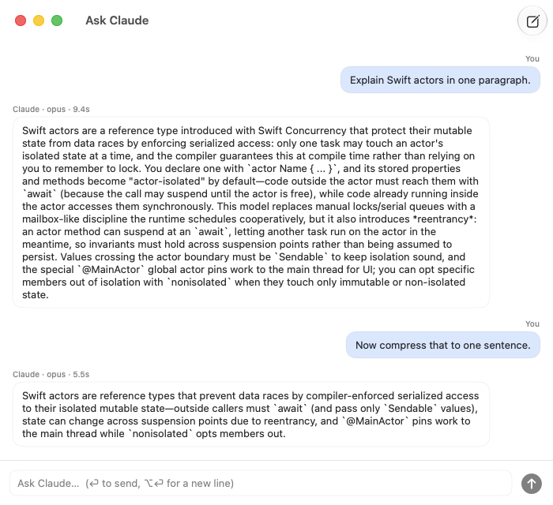

# Ask Claude

**中文** | [English](README_EN.md)

使用你的 **Claude 订阅**的小巧原生 macOS 聊天应用，无需 API 密钥，也没有额外计费。

它调用已经安装的 [Claude Code CLI](https://claude.com/claude-code)（`claude -p`），每次提问使用现有的 Claude Pro/Max 套餐，就像在终端里提问，同时提供聊天窗口、实时流式输出和多轮对话记忆。



## 为什么使用它

- **无需 API 密钥。** 使用 `claude` 程序自身的登录状态。终端中能运行 `claude`，应用就能使用。
- **流式显示进度。** 从连接、确认模型，到文字逐步出现，避免面对空白窗口等待。
- **多轮记忆。** 通过 CLI 会话机制（`--resume`）继续对话，⌘N 新建会话。
- **原生且小巧。** 纯 SwiftUI，一个小型二进制文件，无 Electron、网页视图或后台守护进程。
- **默认使用 Opus。** 快速提问也使用最佳模型；可通过下文的一条 `defaults write` 命令切换。

## 环境要求

- macOS 15+（Apple Silicon）
- 安装并登录 [Claude Code CLI](https://claude.com/claude-code)，在终端中可以运行 `claude`
- Claude 订阅（Pro / Max）

## 安装

**下载发行版：** 从 [Releases](../../releases) 下载 `AskClaude-<version>-arm64.zip`，解压后将 `Ask Claude.app` 移到 `/Applications`。

应用使用临时签名（没有付费 Apple Developer 证书），macOS 会对下载内容添加隔离标记。执行一次以下命令即可清除：


```bash
xattr -cr "/Applications/Ask Claude.app"
```

也可以右键应用 → 打开，再在 **系统设置 → 隐私与安全性** 中允许运行。

**从源码安装：**


```bash
git clone https://github.com/zengtianli/ask-claude.git
cd ask-claude
./build.sh --install   # requires Xcode
```

## 配置

所有配置都是可选项，存放在 `defaults` 中：


```bash
# Model passed to `claude --model` (default: opus)
defaults write io.github.zengtianli.AskClaude model sonnet

# Explicit path to the claude binary, if yours lives somewhere unusual
defaults write io.github.zengtianli.AskClaude claudePath ~/my/bin/claude
```

应用依次在 `~/.local/bin`、`/opt/homebrew/bin`、`/usr/local/bin` 和 `$PATH` 中查找 `claude`。

## 常见问题

**订阅之外还会额外收费吗？**
不会。应用在本机运行 `claude -p`，配额和计费与直接使用 CLI 相同，没有额外费用。

**提示“Claude Code CLI not found”？**
从 <https://claude.com/claude-code> 安装，或设置 `claudePath`（见“配置”）。

**为什么首次启动提示应用“已损坏”或被阻止？**
这是临时签名导致的。执行一次 `xattr -cr "/Applications/Ask Claude.app"`，或在系统设置 → 隐私与安全性中允许运行。从源码构建可避免这一问题。

**对话保存在哪里？**
没有新增存储位置。会话由本机 Claude Code CLI 管理，与终端使用方式相同；应用不自行保存聊天历史。

## 许可

[MIT](LICENSE)

## 与私有版本的关系

本仓库是作者私有版本的**单向快照**。只有私有版本发布时才会更新；日常私有提交不会镜像到这里，因此本仓库可能落后于私有版本。（此规则于 2026-08-10 确定。）
